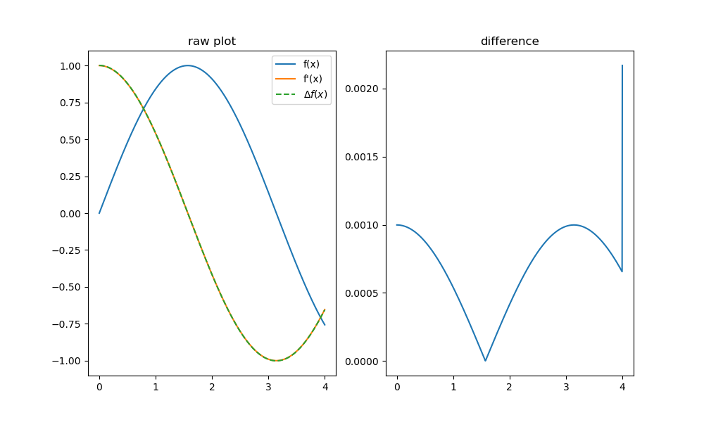
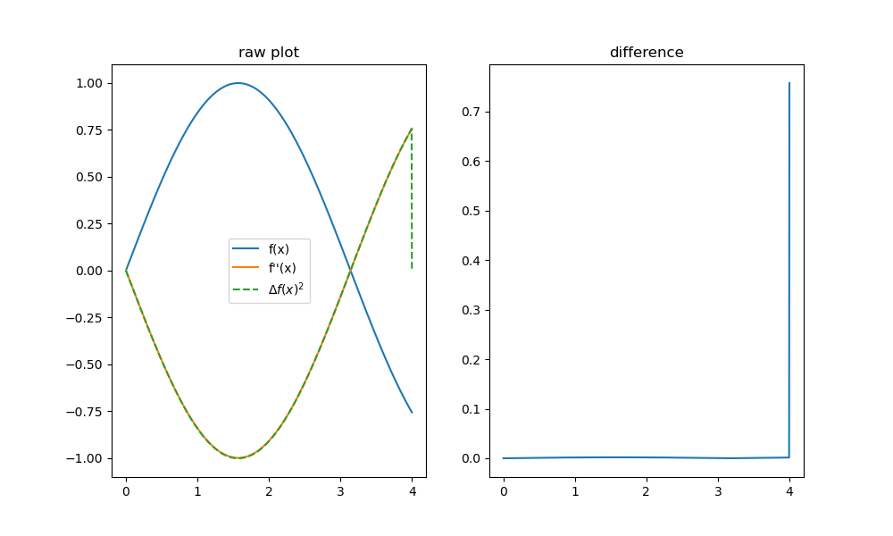
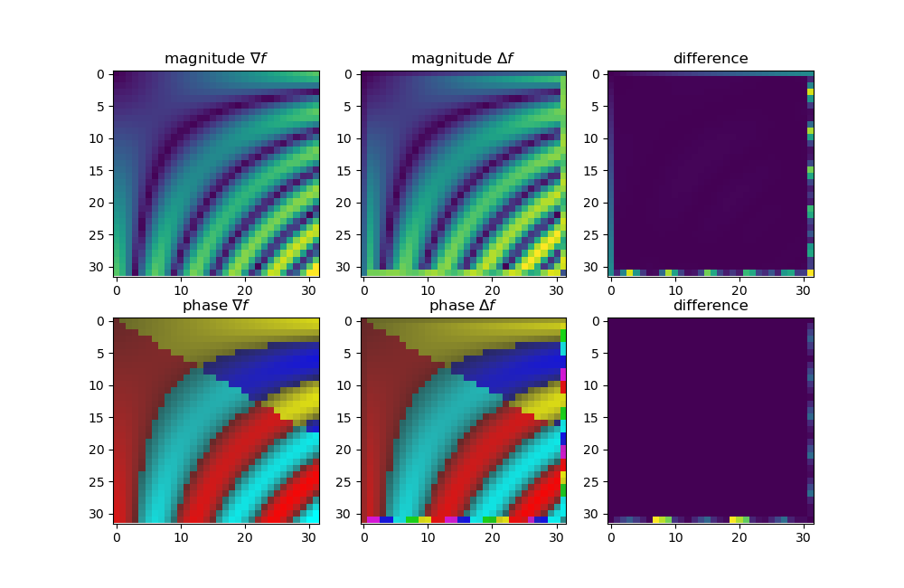
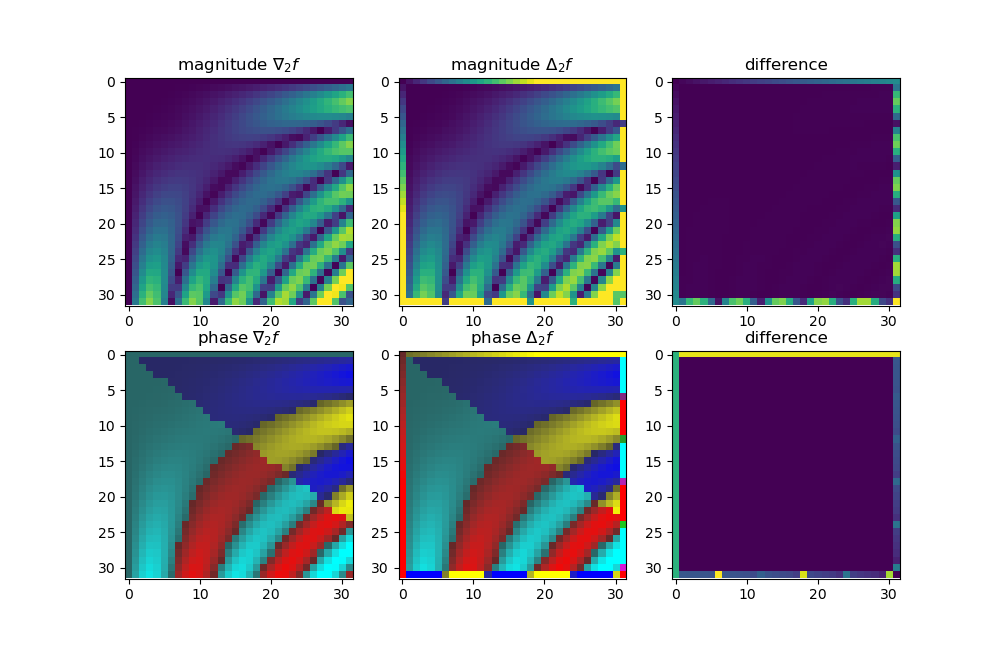
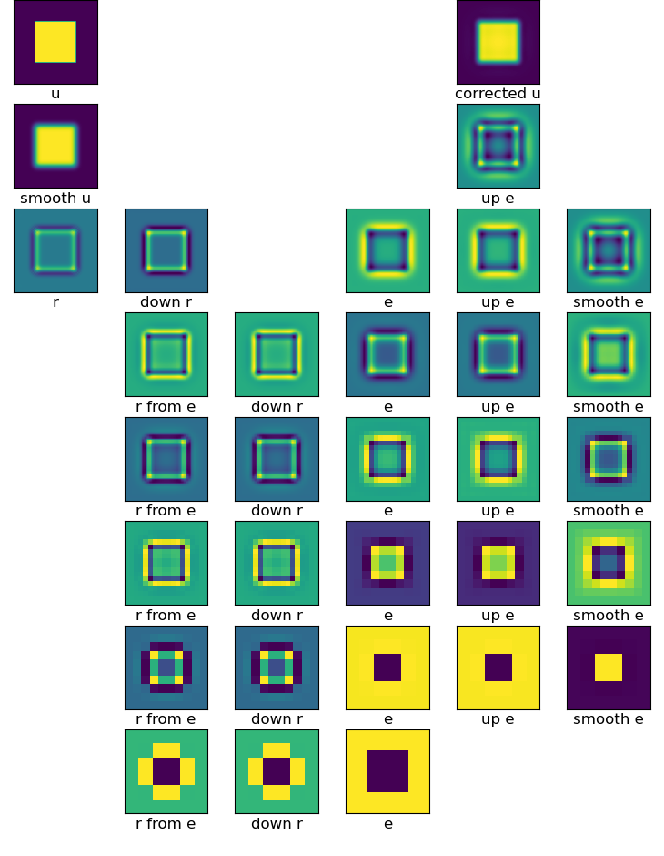
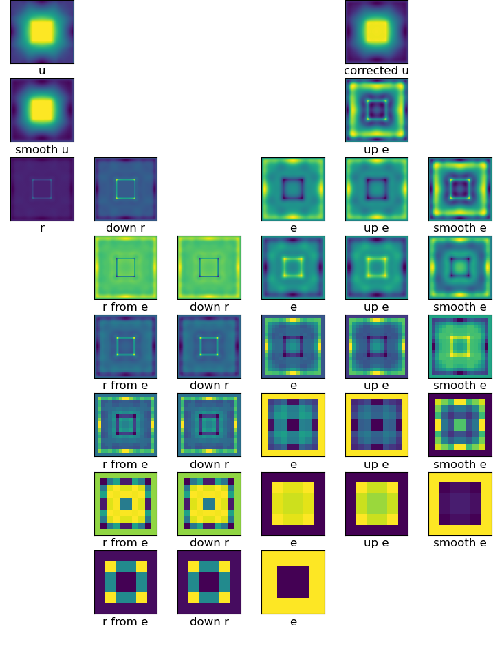
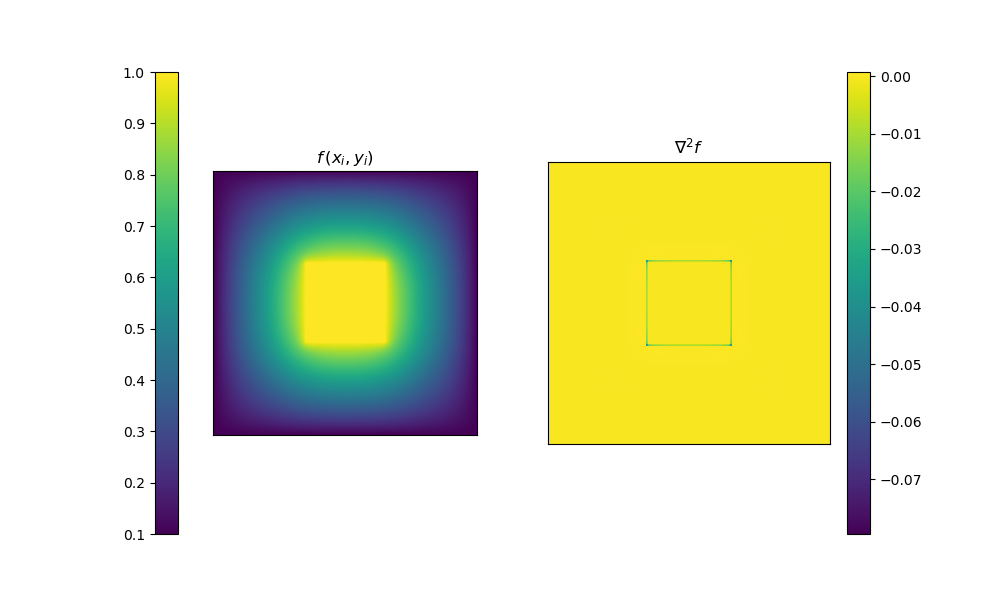
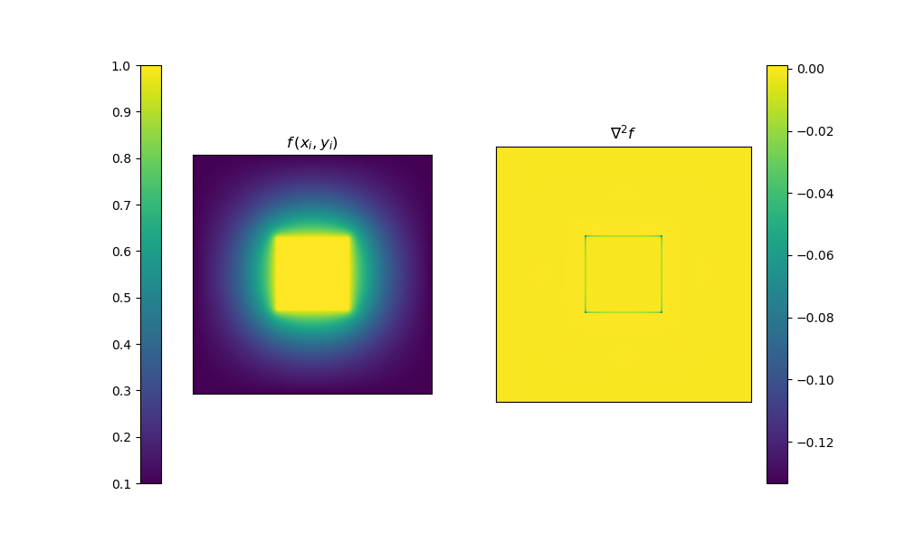
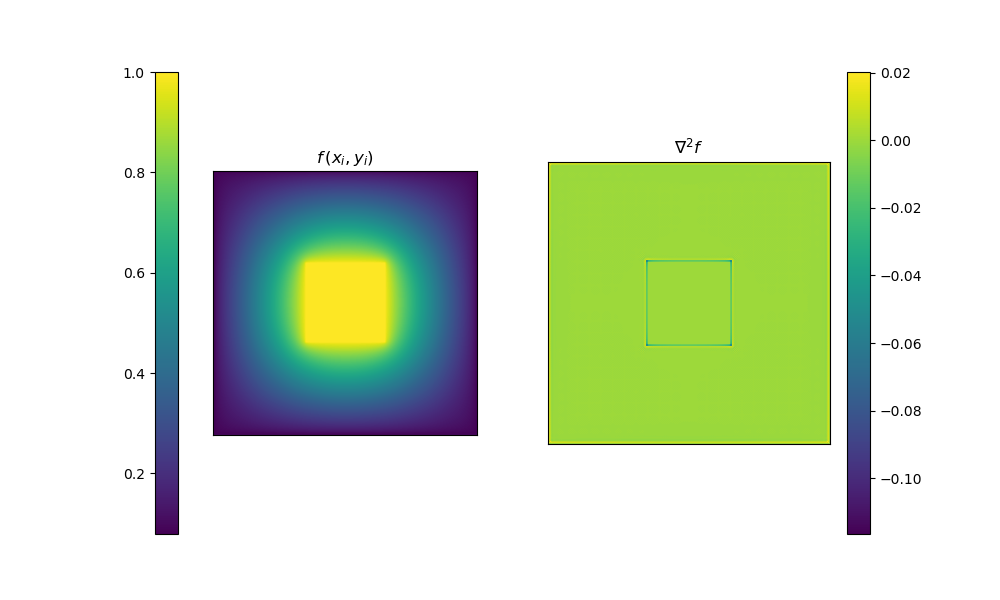
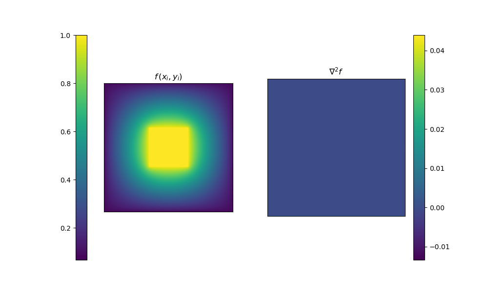

# Deep Learning for PDE's
## Motivation
I am interested in large-scale simulation for artistic recreation. 
I find a lot of the patterns and chaotic dynamics found in the natural world 
quite beautiful, as I'm sure most people do. In a sort of "aesthetically"-driven
pursuit of replicating this, I hope I can learn more about a wide array
of fields and potentially produce novel results.

Although in general I wish to make use of geo-physical simulation 
for planet-scale landform generation, in this work I am particularly
building up to modelling mantle convection and the interactions between
the mantle and the lithosphere. With such results, as I wish to create
a pseudo-real-time simulation, I will look into approximation methods that 
utilize modern techniques from deep learning.

- [Deep Learning for PDE's](#deep-learning-for-pdes)
  - [Motivation](#motivation)
  - [1. Recap of Numerical Differentiation](#1-recap-of-numerical-differentiation)
    - [1.1 First Order - Single Variable](#11-first-order---single-variable)
    - [1.2 Second Order - Single Variable](#12-second-order---single-variable)
    - [1.3 First Order - Multiple Variables](#13-first-order---multiple-variables)
    - [1.4 Second Order - Multiple Variables](#14-second-order---multiple-variables)
  - [2. The Laplace Equation](#2-the-laplace-equation)
    - [2.1 Formulation](#21-formulation)
    - [2.2 Implementation](#22-implementation)
    - [2.3 Geometric Multi-Gridding](#23-geometric-multi-gridding)
      - [Smoothing / Relaxation](#smoothing--relaxation)
      - [Restriction](#restriction)
      - [Prolongation](#prolongation)
      - [V-Cycles](#v-cycles)
      - [W-Cycles](#w-cycles)
    - [2.4 A GPU Coarse-to-Fine Approach](#24-a-gpu-coarse-to-fine-approach)
      - [Laplace iteration as convolution](#laplace-iteration-as-convolution)
      - [Prolongation as transposed convolution](#prolongation-as-transposed-convolution)
  - [3. Poisson and Helmholtz Equations](#3-poisson-and-helmholtz-equations)
    - [3.1 Poisson's Equation](#31-poissons-equation)
    - [3.2 Time-Dependency in the Forcing Term](#32-time-dependency-in-the-forcing-term)
    - [3.3 Helmholtz Equation](#33-helmholtz-equation)
    - [3.4 Generalized Form with Time Dependence](#34-generalized-form-with-time-dependence)
  - [4. The Advection-Diffusion Equation](#4-the-advection-diffusion-equation)
    - [4.1 One Spatial Dimension](#41-one-spatial-dimension)
    - [4.2 Two Spatial Dimensions](#42-two-spatial-dimensions)
  - [5. Rayleigh-Benard Convection](#5-rayleigh-benard-convection)

## 1. Recap of Numerical Differentiation
### 1.1 First Order - Single Variable
There are many ways to calculate the slope of the secant line at a point $x$. 
$$
f'(x) = \lim_{h \to 0} \frac{f(x+h) - f(x)}{h} \tag*{(Forward Difference)}
$$

$$
f'(x) = \lim_{h \to 0} \frac{f(x) - f(x-h)}{h}     \tag*{(Backward Difference)}
$$

$$
f'(x) = \lim_{h \to 0} \frac{f(x+h) - f(x-h)}{2h}  \tag*{(Centered Difference)}
$$

Ofcourse, for the numerical approach instead of a continuum of values
for a function $f$, we have the descretization $f_i$ over the ordered set of 
sample points $i \in N$. Each $f_i$ is thus sampled a distance of 
$\Delta x = \frac{1}{n} (R_{max} - R_{min})$ away from the last point,
over a domain region $[R_{min}, R_{max}]$. 

Recall the Taylor Series for a function $f$, evaluated at some $a$ 
for a given $x_0$,
$$
f(x_0) \approx \sum_{n=0}^\infty \frac{(x_0 - a)^n}{n!} \cdot f^{(n)}(a)
$$ 

If we were to take the forward difference approach, consider
taking the Taylor series expansion at $x$, given $x+h$,
$$
f(x+h) \approx \sum_{n=0}^\infty \frac{h^n}{n!} \cdot f^{(n)}(x)
= f(x) + hf'(x) + \frac{h^2}{2} f''(x) + \dots \tag*{(1)}
$$

Thus, as an approximation for $f'$ using our forward difference approach yields,
$$
f'(x) \approx \frac{f(x+h) - f(x)}{h} 
\approx \sum_{n=1}^\infty \frac{h^{n-1}}{n!} \cdot f^{(n)}(x)
= f'(x) + \frac{h}{2!} f''(x) + \dots
$$

Let $f^\star$ represent our approximation of $f'$.
The truncation error $\varepsilon_t$ is then given by,
$$
\begin{aligned}
\varepsilon_t 
&= \big\vert f'(x) - f^\star \big\vert\\
&= \Big\vert \frac{h}{2!} f''(x) + \frac{h^2}{3!} f'''(x) + \dots \Big\vert\\
&= \mathcal{O}(h f'')
\end{aligned}
$$

If we were to instead look into the central difference method,
first take the following Taylor series expansion,
$$
f(x-h) \approx \sum_{n=0}^\infty \frac{(-h)^n}{n!} \cdot f^{(n)}(x)
= f(x) - hf'(x) + \frac{h^2}{2} f''(x) - \dots \tag*{(2)}
$$

Combining and simplifying equations (1) and (2),
$$
\begin{aligned}
f(x+h) - f(x-h) &\approx \sum_{n=0}^\infty \frac{h^n}{n!} \cdot f^{(n)}(x) - \sum_{n=0}^\infty \frac{(-h)^n}{n!} \cdot f^{(n)}(x)\\
&= \sum_{n=1}^\infty \frac{h^n - (-h)^n}{n!} \cdot f^{(n)}(x)\\
&= 2 \cdot \sum_{k=1}^\infty \frac{h^{2k-1}}{(2k-1)!} \cdot f^{(2k-1)}(x)
\end{aligned}
$$

The central difference approximation then becomes,
$$
f'(x) \approx \frac{f(x+h) - f(x-h)}{2h}
\approx \cdot \sum_{k=1}^\infty \frac{h^{2k-2}}{(2k-1)!} \cdot f^{(2k-1)}(x)
$$

The truncation error for this method is noticeably **much less** than that
of the forward difference method. Thus, moving forward throughout this
work when taking gradients we will assume the central difference method
unless stated otherwise.
$$
\begin{aligned}
\varepsilon_t 
&= \big\vert f'(x) - f^\star \big\vert\\
&= \Big\vert \frac{h^2}{3!} f'''(x) + \frac{h^4}{5!} f^{(5)}(x) + \dots \Big\vert\\
&= \mathcal{O}(h^2 f''')
\end{aligned}
$$

This ofcourse leads to the requirement for *boundary conditions*.  
Consider when $i=0$, our update rule yields 
$f_0 = \frac{1}{2h}(f_1 - f_{-1})$.
Likewise at $i=n-1$, 
$f_{n-1} = \frac{1}{2h}(f_n - f_{n-2})$.

One way to get around this is to assume local-continuation at the bounds,
$$
f_{-1} = f_0 - (f_1 - f_0) \qquad \qquad
f_{n} = f_{n-1} + (f_{n-1} - f_{n-2})
$$

Programmatically this can be represented by the following, where `f`
denotes the function $f$ and `ff` its derivative, $f'$.
```python
x  = np.linspace(rmin,rmax,n)
y  = f(x)
yy = ff(x)

diff = np.zeros(n)
h = (rmax - rmin) / n
recip = 1.0 / (2*h)

# central difference
diff[1:-1] = (y[2:] - y[:-2]) * recip

# boundary conditions
bot_diff = y[0] - (y[1] - y[0])
diff[0] = (y[1] - bot_diff) * recip

top_diff = y[-1] + (y[-1] - y[-2])
diff[-1] = (top_diff - y[-2]) * recip
```


### 1.2 Second Order - Single Variable
For a second order derivative, there is an altered form for the centred
difference,
$$
f'(x) \approx \frac{f(x+\frac{1}{2}h) - f(x-\frac{1}{2}h)}{h}
$$

This yields,
$$
\begin{aligned}
f''(x) 
&\approx \frac{f'(x+\frac{1}{2}h) - f'(x-\frac{1}{2}h)}{h}\\
&\approx \frac{1}{h} \Big( \frac{f(x+h) - f(x)}{h} - \frac{f(x) - f(x - h)}{h} \Big)\\
&= \frac{1}{h^2} \Big( f(x+h) + f(x - h) - 2\cdot f(x) \Big)\\
\end{aligned}
$$

Programatically, this is very similar to the previous example.
```python
x  = np.linspace(rmin,rmax,n)
y  = f(x)
yy = ff(x)

diff = np.zeros(n)
h = (rmax - rmin) / n
recip = 1.0 / (h**2)

# central difference
diff[1:-1] = (y[2:] + y[:-2] - 2*y[1:-1]) * recip

# boundary conditions
bot_diff = y[0] - (y[1] - y[0])
diff[0] = (y[1] + bot_diff - 2*y[0]) * recip

top_diff = y[-1] + (y[-1] - y[-2])
diff[-1] = (top_diff + y[-2] - 2*y[-1]) * recip
```


### 1.3 First Order - Multiple Variables
Considering the multivariate case as an extension of the single variable derivation
from prior,
$$
\begin{aligned}
f_x(x,y) &\approx \frac{1}{2h} \Big( f(x+h, y) - f(x-h, y)  \Big)\\
f_y(x,y) &\approx \frac{1}{2h} \Big( f(x, y+h) - f(x, y-h)  \Big)
\end{aligned}
$$

As you can expect, this requires boundary conditions for all $(x,y)$ on
the boundary of our target region $\partial R$. 
In the following implementation, I let the boundary be simply zero.
Notice the effect this has in the residual plots,
```python
h = (rmax - rmin) / n
recip = 1.0 / (2*h)

X = np.linspace(rmin, rmax, n)
Y = np.linspace(rmin, rmax, n)
x,y = np.meshgrid(X,Y)

z  = f(x,y)
zx = fx(x,y)
zy = fy(x,y)

z_bounds = np.zeros([n+2, n+2])
z_bounds[1:-1,1:-1] = z

# central differences
grad = np.zeros([n, n, 2])
grad[:,:,0] = z_bounds[1:-1, 2:] - z_bounds[1:-1,  :-2]  # f_x
grad[:,:,1] = z_bounds[2:, 1:-1] - z_bounds[:-2,  1:-1]  # f_y
grad *= recip
```


### 1.4 Second Order - Multiple Variables
Likewise, the second order extension is,
$$
\begin{aligned}
f_{xx}(x,y) &\approx \frac{1}{h^2} \Big( f(x+h, y) + f(x-h, y) - 2f(x,y) \Big)\\
f_{yy}(x,y) &\approx \frac{1}{h^2} \Big( f(x, y+h) + f(x, y-h) - 2f(x,y) \Big)
\end{aligned}
$$

```python
z2 = 2 * z_bounds[1:-1, 1:-1]
grad = np.zeros([n, n, 2])
grad[:,:,0] = z_bounds[1:-1, 2:] + z_bounds[1:-1,  :-2] - z2  # f_xx
grad[:,:,1] = z_bounds[2:, 1:-1] + z_bounds[:-2,  1:-1] - z2  # f_yy
grad *= recip
```


## 2. The Laplace Equation
### 2.1 Formulation
Laplace's equation is given by the following,
$$
\nabla^2 f = 0 \qquad \Leftrightarrow \qquad 
\frac{\partial^2 f}{\partial x^2} + \frac{\partial^2 f}{\partial y^2} = 0
$$

From the work done in the prior section, we can find an expression
for the approximate value of $f$,
$$
\begin{aligned}
0
&= \frac{\partial^2 f}{\partial x^2} + \frac{\partial^2 f}{\partial y^2}\\
&\approx \frac{1}{h^2}\Big( f(x+h, y) + f(x-h, y) - 2f(x,y) \Big) 
 + \frac{1}{h^2}\Big( f(x, y+h) + f(x, y-h) - 2f(x,y) \Big)\\
&\approx f(x+h, y) + f(x-h, y) + f(x, y+h) + f(x, y-h) - 4f(x,y)\\
f(x,y) &\approx \frac{1}{4} \Big( f(x+h, y) + f(x-h, y) + f(x, y+h) + f(x, y-h) \Big)\\
\end{aligned}
$$

Notice $f$ is dependent on its neighbors. 
If we consider this as an update rule,
by iteratively applying the rule the boundary conditions will 
dissipate outwards and perhaps converge to a solution, 
where further iterations yield no change.

Let $f^k_{i,j}$ be the $k$-th iteration, at position $(i,j)$ in the grid. Thus our update rule can be represented by,
$$
f^{k+1}_{i,\,j} = \frac{1}{4}\Big( f^k_{i+1,\,j} + f^k_{i-1,\,j} + f^k_{i,\,j+1} + f^k_{i,\,j-1} \Big)
$$
Where $f^0$ is taken to be the initial estimation. 

### 2.2 Implementation
For an example, I considered the heat steady-state
interpretation of the Laplace Equation. For each iteration step
taken, the output will diffuse the initial heat until eventually
it converges to the steady-state. 

An initial block radiating heat is placed at the center, and kept there through the `condition` function.
```python
ub = np.zeros([t+1, n+2, n+2])
ub[0] = condition(ub[0], sample)
for k in range(t):
    ub[k+1, 1:-1, 1:-1] = ub[k, 2:,  1:-1] + ub[k, :-2, 1:-1] + \
                          ub[k, 1:-1, 2:]  + ub[k, 1:-1, :-2]
    ub[k+1, 1:-1, 1:-1] *= 0.25

    # reapply heat source condition
    ub[k+1] = condition(ub[k+1], sample)

```

Evaluating at `n=16` and `t=128`, showing convergence.  


Evaluating at `n=128` and `t=128`, convergence slows down dramatically.  


Evaluating at `n=256` and `t=512`.  


From this we can see that not only is convergence slow, but the rate of
convergence is inversely proportional to the dimensions of the initial grid,
which makes sense given the propagation process mentioned earlier.

### 2.3 Geometric Multi-Gridding

Consider the following, where $f^\star$ denotes the true value, and the error $e$ is given by,
$$
f^\star = f + e \tag*{(1)}
$$

Computing the error from equation (1) is not as easy as we would like it to be.
Thus, instead of finding the error, let the residual $r$ be a measure
of the distance between the approximation $\nabla^2 f$ and the target 0.
$$
\nabla^2 f^\star = 0 \qquad \Rightarrow \qquad 
r = 0 - \nabla^2 f \tag*{(2)}
$$
Computing the residuals can be done by,
$$
r_{i,j} = -\frac{1}{h^2} \Big( 
    f_{i+1,j} + f_{i-1,j} + f_{i,j+1} + f_{i,j-1} - 4f_{i,j} 
\Big) \tag*{(2b)}
$$

Applying equations (1) and (2) to the original PDE yields
an equation for the error.
$$
\nabla^2 f^\star = 0     \,\, \Leftrightarrow \,\,
\nabla^2 (f + e) = 0     \,\, \Leftrightarrow \,\,
\nabla^2 e = -\nabla^2 f \qquad \Leftrightarrow \qquad
\nabla^2 e = r \tag*{(3)}
$$

Solving the error equation can be done in a similar matter to our
iterative approach to the Laplace equation, where we have an initial
guess for the error, typically zero. **Notice** how $h$ **cancels out** from equation (2b). 
$$
\begin{aligned}
h^2 r_{i,j} &\approx e_{i+1,j} + e_{i-1,j} + e_{i,j+1} + e_{i,j-1} - 4e_{i,j}\\ 
\Rightarrow \qquad e^{k+1}_{i,j} &=
\frac{1}{4} \Big( 
    e^k_{i+1,j} + e^k_{i-1,j} + e^k_{i,j+1} + e^k_{i,j-1} - h^2 r_{i,j} \Big)
\end{aligned}
$$

Once we have an approximation for the error, we can use that to correct
our approximation of $f$, in a similar notion to that demonstrated in equation (1).
$$
\hat{f}^k_{i,j} = f^k_{i,j} + e^m_{i,j}
$$
Where $e^m$ is the error after $m$ iterations, and $\hat{f}$ represents the
corrected approximation.

As mentioned prior, the way in which we have formulated our numerical scheme 
yields equations dependent on the neighbors of each descretized cell.
This locally binds our convergence, as the larger the grid size $n$ grows,
the longer it will take for information to propagate through the domain.

Geometric Multi-Gridding attempts to solve the equations recursively
over a series of different sized "grids", the matrices we use. 
Typically, you will see the largest matrix defined as the **fine** grid,
and the smallest matrix as the **coarse** grid. The way in which
we move through the grids is what defines the type of "cycle".

Moving through the grids requires some operations and terminology common to the literature.
#### Smoothing / Relaxation
_In solving the poisson equation $\nabla^2 f = g$ numerically, the resulting equations have 
the effect of smoothing the solution. For example, in solving the error equation:_
```python
def smooth_errors(e,r):
    # expects bounded matrices
    x = e[2:, 1:-1] + e[:-2, 1:-1] + \
        e[1:-1, 2:] + e[1:-1, :-2]
    x -= r[1:-1,1:-1]
    return x * 0.25
```

#### Restriction
_To move between grids requires a scheme for interpolation. A simple approach to move from a $(2n)^2$
grid to a $n^2$ grid is to take the average of each 2x2 region and collapse that into a single pixel._
```python
def restrict(x):
    y = np.zeros([((i-2)//2) + 2 for i in x.shape])
    y[1:-1, 1:-1] = x[1:-1:2, 1:-1:2] + x[2::2, 1:-1:2] + \
                    x[1:-1:2, 2::2]   + x[2::2, 2::2]
    return y * 0.25
```

#### Prolongation
_Prolongation is the more complex of the grid operations, requiring the interpolation between points.
A surprisingly effective, albeit naive approach, is inverse of the simple restriction. Expand
each pixel into a 2x2 region verbatim._
```python
def prolong(x):
    y = np.zeros([(i-1)*2 for i in x.shape])

    # expand by factor of 2
    y[1:-1:2, 1:-1:2] = x[1:-1, 1:-1]
    y[2::2,   1:-1:2] = x[1:-1, 1:-1]
    y[1:-1:2, 2::2]   = x[1:-1, 1:-1]
    y[2::2,   2::2]   = x[1:-1, 1:-1]

    return y
```
Ofcourse, this does not need be so naive.
```python
def prolong_smooth(x):
    y = np.zeros([(i-1)*2 for i in x.shape])

    # expand by factor of 2
    y[1:-1:2, 1:-1:2] = x[1:-1, 1:-1]
    y[2::2,   1:-1:2] = x[1:-1, 1:-1]
    y[1:-1:2, 2::2]   = x[1:-1, 1:-1]
    y[2::2,   2::2]   = x[1:-1, 1:-1]

    # take inner averages
    y[2:-2, 2:-2] = y[3:-1, 2:-2] + y[1:-3, 2:-2] + \
                    y[2:-2, 3:-1] + y[2:-2, 1:-3]
    y *= 0.25

    # compute directional differences at the bounds
    y2 = 2 * y
    y[2:-2,  1] = y2[2:-2,  2] - y[2:-2,  3] # left  side
    y[2:-2, -2] = y2[2:-2, -3] - y[2:-2, -4] # right side
    y[1,  2:-2] = y2[ 2, 2:-2] - y[ 3, 2:-2] # top   side
    y[-2, 2:-2] = y2[-3, 2:-2] - y[-4, 2:-2] # bot   side

    # corner values are the average of their neighbors
    third = 1.0 / 3.0
    y[ 1, 1] = (y[ 1, 2] + y[ 2, 1] + y[ 2, 2]) * third #top left
    y[ 1,-2] = (y[ 1,-3] + y[ 2,-2] + y[ 2,-3]) * third #top right
    y[-2, 1] = (y[-2, 2] + y[-3, 1] + y[-3, 2]) * third #bot left
    y[-2,-2] = (y[-2,-3] + y[-3,-2] + y[-3,-3]) * third #bot right

    return y
```

#### V-Cycles

A V-Cycle, given in name by the diagram of grid traversals,
is algorithmically given by: 
* 1. Iterate $\nabla^2 f = 0$ on the coarsest grid.
* 2. Compute the residuals in the Laplace iterations, $r = - \nabla^2 f$.
* 3. Restrict the resisdual to a coarser grid.
* 4. Iterate $\nabla^2 e = r$, with initial guess $e = 0$.
* 5. Compute the residuals in the error, $r = - \nabla^2 e$.
* 6. Jump to (3) if not at coarsest grid.
* 7. Iterate $\nabla^2 e = r$.
* 8. Prolong $e$ to a finer grid.
* 9. Correct the error, $e = e_{fine} + e_{coarse}$.
* 10. Iterate $\nabla^2 e = r$.
* 11. Jump to (8) if not at largest coarse grid.
* 12. Prolong $e$ to finest grid.
* 13. Correct the Laplace iteration, $\hat{f} = f_{} + e$.

Graphically this produces the following:
* a) Without smooth prolongation:  

* b) With smooth prolongation:  


On the topic of initialisation, a good first estimation would of the problem
could ofcourse arrive from merely solving the coarsest problem and prolongating
that outwards to the finest grid.
```python
# solve the coarse problem as an initial guess
ub[0] = condition(ub[0],masks[0],r=r)
for _ in range(q):
    ub[0,1:-1,1:-1] = smooth_laplace(ub[0])
    ub[0] = condition(ub[0],masks[0],r=r)

coarse = restrict(ub[0])
for _ in range(d-1):
    coarse = restrict(coarse)

for _ in range(q):
    coarse[1:-1,1:-1] = smooth_laplace(coarse)
    coarse = condition(coarse,masks[-1],r=r)

for i in range(d-1):
    coarse = prolong(coarse)
    coarse = condition(coarse,masks[-i-2],r=r)

ub[0] = prolong(coarse)
```

Convergence can then be specified by a tolerance $\gamma$, such that $(f^{k+1} - f^{k})^2 < \gamma$.
The implication being that the mean squared error between convergence iterations will decrease until acceptable.
Running at a tolerance of $10^{-6}$, for at a size of $256^2$, traversing 6 grids, applying 30 smoothing iterations on each grid,
and 50 on the coarsest grid.  


With initialisation,  


With smooth prolongation,  


With initialisation and smooth prolongation,  


#### W-Cycles
Another scheme for grid traversal is the W-Cycle, in which instead of traversing upwards the full path,
one:
* traverses upwards half-way
* traverse downward to the coarsest grid
* traverse upwards to the finest grid


With initialisation,  


With smooth prolongation,  


With initialisation and smooth prolongation,  


### 2.4 A GPU Coarse-to-Fine Approach
#### Laplace iteration as convolution
The laplace iteration can be turned into a kernel used in 2D-convolution, which is very popular in the deep learning
field, and has often support for GPU accellerated versions of the operation to allow for massively
parallel execution across the grid.
```python
import torch.nn.functional as tf

'''
           0    | 0.25 | 0            f[i-1,j-1] | f[i,j-1]  | f[i+1,j-1]
           -------------------        ------------------------------------
f[i,j] =   0.25 | 0    | 0.25     *   f[i-1,j]   | f[i,j]    | f[i+1,j]    
           -------------------        ------------------------------------
           0    | 0.25 | 0            f[i-1,j+1] | f[i,j-1]  | f[i+1,j+1]
'''

w = torch.zeros(1,1,3,3)
w[0,0,1,:] = 0.25
w[0,0,:,1] = 0.25
w[0,0,1,1] = 0

multi_grid[i][:,idx:idx+1] = tf.conv2d(multi_grid[i][:,idx:idx+1], w, padding=1)
```

#### Prolongation as transposed convolution
Likewise, the naive prolongation used prior can be done quite easily as a transposed 2D-convolution.
```python
import torch.nn.functional as tf

'''
f[i,j]   | f[i+1,j]        1 | 1
----------------------  =  -----  *  f[i,j]
f[i,j+1] | f[i+1,j+1]      1 | 1
'''

up = torch.ones(1,1,2,2)

multi_grid[i+1][:,0:1,1:-1, 1:-1] = tf.conv_transpose2d(multi_grid[i][:,idx:idx+1,1:-1,1:-1], up, stride=2)
```

This converges much faster than both V-Cycles and W-Cycles. For a $256^2$ fine grid, at 6 traversals
and a tolerance of $10^{-6}$.  


Extending to a $2048^2$ fine grid with 10 traversals at a tolerance of $10^{-6}$ is done easily.  


## 3. Poisson and Helmholtz Equations
### 3.1 Poisson's Equation
Naive
$$
\begin{aligned}
g &= \nabla^2 f\\
g_{i,j} &= \frac{1}{h^2} \Big( f_{i+1,j} + f_{i-1,j} + f_{i,j+1} + f_{i,j-1} - 4f_{i,j} \Big)\\
f_{i,j} &= \frac{1}{4} \Big( f_{i+1,j} + f_{i-1,j} + f_{i,j+1} + f_{i,j-1} - h^2g_{i,j} \Big)
\end{aligned}
$$

Multigridding
$$
f^\star = f + e \tag*{(1)}
$$

$$
\nabla^2 f^\star = g \qquad \Rightarrow \qquad 
r = g - \nabla^2 f \tag*{(2)}
$$

$$
h^2 r_{i,j} = h^2 g_{i,j} - \Big( 
    f_{i+1,j} + f_{i-1,j} + f_{i,j+1} + f_{i,j-1} - 4f_{i,j} 
\Big)
$$

$$
\nabla^2 f^\star = 0     \,\, \Leftrightarrow \,\,
\nabla^2 (f + e) = 0     \,\, \Leftrightarrow \,\,
\nabla^2 e = -\nabla^2 f \qquad \Leftrightarrow \qquad
\nabla^2 e = r \tag*{(3)}
$$

$$
\begin{aligned}
h^2 r_{i,j} &\approx e_{i+1,j} + e_{i-1,j} + e_{i,j+1} + e_{i,j-1} - 4e_{i,j}\\ 
\Rightarrow \qquad e^{k+1}_{i,j} &=
\frac{1}{4} \Big( 
    e^k_{i+1,j} + e^k_{i-1,j} + e^k_{i,j+1} + e^k_{i,j-1} - h^2 r_{i,j} \Big)
\end{aligned}
$$

### 3.2 Time-Dependency in the Forcing Term
### 3.3 Helmholtz Equation
### 3.4 Generalized Form with Time Dependence

## 4. The Advection-Diffusion Equation
### 4.1 One Spatial Dimension
### 4.2 Two Spatial Dimensions

## 5. Rayleigh-Benard Convection
